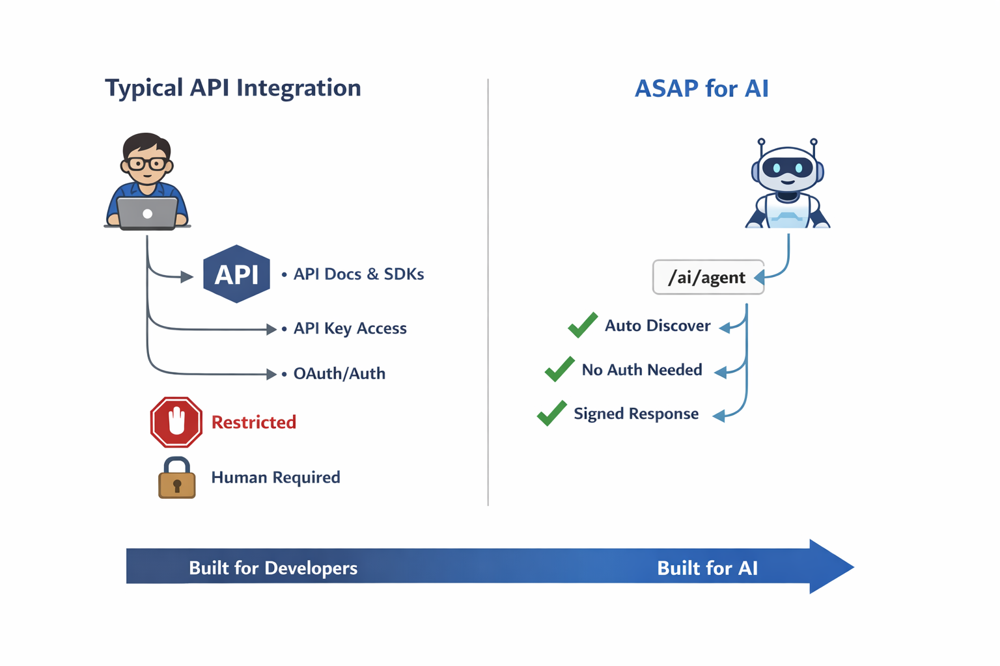
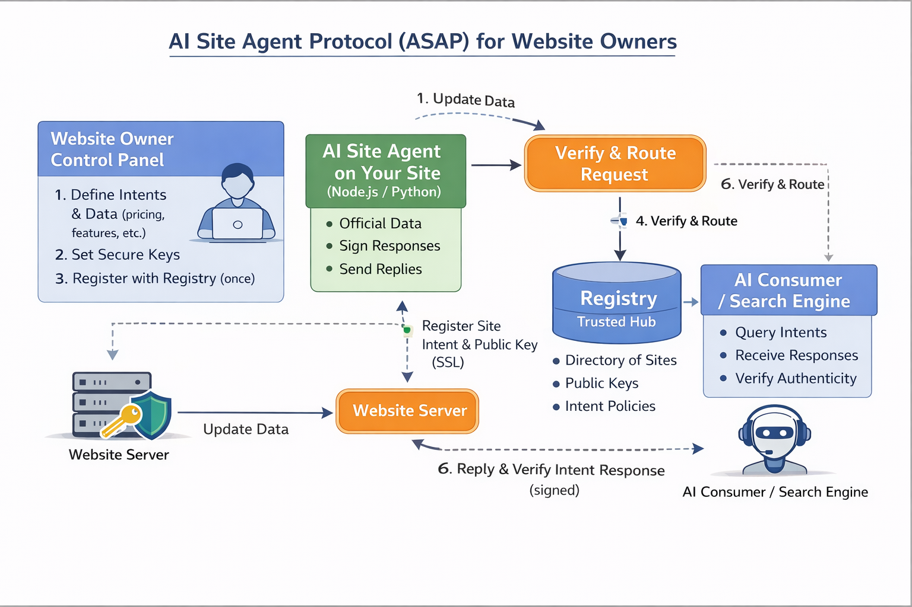
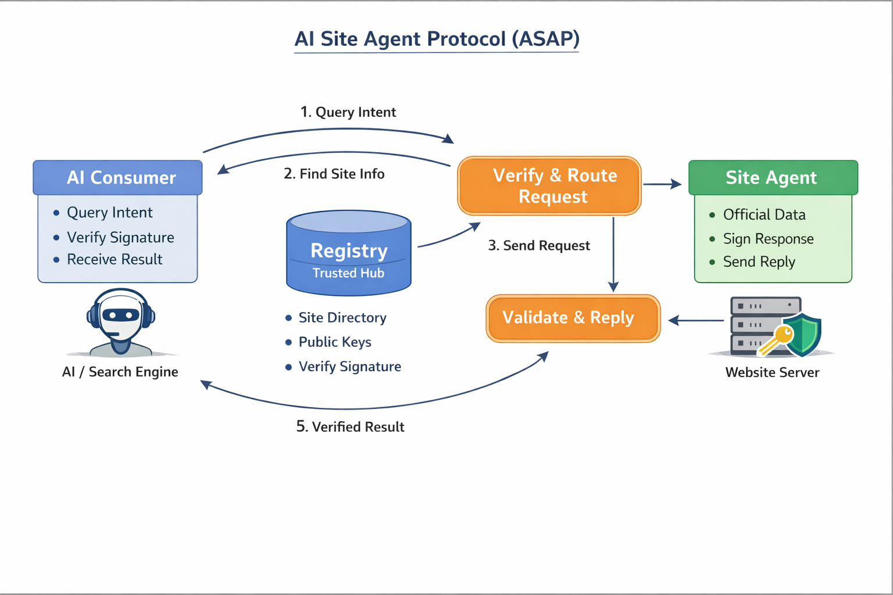

# 🤖 ASAP — AI Site Agent Protocol

> **Canonical Reference Repository**  
> **Version:** 0.1 (Draft) | **Status:** Draft / Proposal

---

## 📋 Overview

**ASAP (AI Site Agent Protocol)** is a web-native protocol designed to enable websites to provide **official, cryptographically verifiable answers** directly to AI systems.

> ⚠️ **It is not a product.**  
> It is a **protocol specification** and **canonical reference**.

ASAP allows AI systems to distinguish between **inferred content** and **site-authoritative responses**, reducing hallucinations, outdated information, and legal or reputational risk.

---

## ❓ Why ASAP Exists

Current AI systems commonly rely on:

- 📊 **Crawled content**
- 🗂️ **Static training snapshots**
- 🎯 **Heuristic inference**

> These approaches **cannot guarantee authority or freshness**.

Websites currently lack a standardized way to declare:

> *"This answer is official, current, and originates from us."*

ASAP addresses this gap by introducing a **machine-verifiable layer of trust**.

> **ASAP does not attempt to judge truth or correctness.**  
> It verifies **origin and authority only**.

---

## ✅ What ASAP Is

- 🔄 **Intent-based communication protocol**
- ✅ **Verification layer, not a data platform**
- 🏢 **Mechanism for websites to answer AI systems directly and authoritatively**

ASAP enables AI systems to **verify responses** instead of **inferring** them.

---

## ❌ What ASAP Is NOT

- 🚫 Not a crawler
- 🚫 Not a search engine
- 🚫 Not an API replacement
- 🚫 Not an AI model
- 🚫 Not a centralized data service

> **ASAP complements existing approaches rather than replacing them.**

### 🔄 API vs ASAP Comparison


---

## 🏗️ Core Components

### 1. 🔧 Site Agent

A service **deployed and controlled by the website owner** that:

- 📨 **Receives intent-based requests**
- 🗄️ **Accesses authoritative site data**
- ✍️ **Generates digitally signed responses**

#### 👤 Site Owner Relationship


### 2. 📚 Registry

A **trust directory** that:

- 🔑 **Publishes site public keys**
- 📋 **Declares agent URLs and supported intents**
- ✅ **Enables response verification**

> **Does not proxy data or answer requests**  
> The registry is a **trust anchor, not a data authority**.

---

## 🔄 High-Level Flow

```
AI Platform
    ↓ (lookup public key / metadata)
Registry
    ↓ (intent request)
Site Agent
    ↓ (signed response)
AI Platform → verifies signature → uses response
```

### 📐 Overall Architecture


---

## 🎯 Key Principles

| Principle | Description |
|-----------|-------------|
| **Authority over truth** | Websites define official data |
| **Intent-driven communication** | AI specifies what, not how |
| **Verification over inference** | Cryptographically signed responses |
| **Decentralized data, minimal trust anchor** | Registry publishes metadata only |
| **AI as verifier, not judge** | No assumptions beyond signature verification |

---

## 📖 Documentation

### 🎯 [Intent Model](./INTENTS.md)
- Intent definitions
- Examples (pricing, features, availability, policy, contact, status)
- Request and response rules

### 🔒 [Security Model](./SECURITY.md)
- Threat model
- Mitigation strategies
- Trust assumptions
- Verification requirements

### 🏛️ [Architecture](./ARCHITECTURE.md)
- Component overview
- Trust boundaries
- Flow diagrams
- Deployment and failure models
- 
📌 This repository is the **official and canonical reference** for the ASAP protocol. 
### 👥 [Governance](./GOVERNANCE.md)
- Canonical reference rules
- Registry governance
- Forking and evolution policy
- Anti-capture guarantees

### 🔌 [Registry API](./REGISTRY_API.md)
- Minimal registry endpoints
- Public key lookup
- Supported intent discovery
- Response formats
- Security considerations

### 📋 [Standardization Roadmap](./STANDARDIZATION.md)
- IETF / W3C / ISO pathways
- Versioning strategy
- Open standardization process

---

## 🧩 Reference Implementation

A public **reference implementation** of the ASAP protocol is available to support early adopters, pilot deployments, and validation of the specification.

- **Repository:**  
  https://github.com/asap-foundation/asap-reference-implementation

- **Purpose:**
  - Demonstrate a compliant ASAP Site Agent
  - Provide concrete examples of intent handling and response signing
  - Serve as a baseline for independent implementations

> ⚠️ This implementation is provided for **reference and experimentation only**.  
> It does **not** define the protocol and does **not** replace this repository as the **canonical specification**.

---

## 📊 Status

| Status | Details |
|--------|---------|
| **Current Status** | Draft / Proposal |
| **Open for** | Public feedback and pilot implementations |
| **Repository** | Serves as canonical reference for ASAP v0.1 |

---

## 📝 Citation

If implementing or referencing ASAP, please cite:

```text
ASAP — AI Site Agent Protocol
Version 0.1 (Draft)
Canonical reference: github.com/asap-foundation/asap-protocol
```

---

## 👤 Authorship

The ASAP protocol concept and canonical specification were **proposed and authored by**:

**Shahram Nematzadeh**

---

## 📄 License

This specification is published for **public reference**.  
Implementations are **permitted**.

> ⚠️ **No entity may claim to be the canonical ASAP registry without explicit attribution to this repository.**
